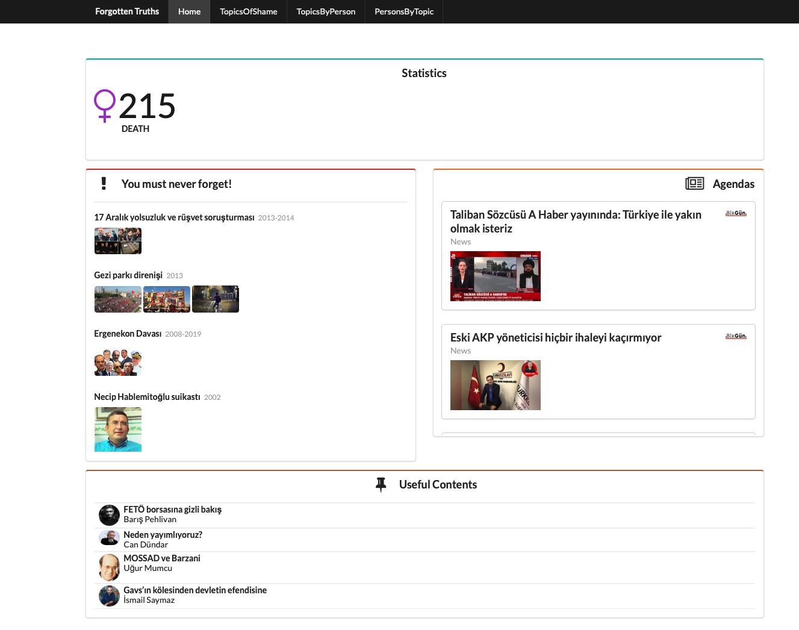
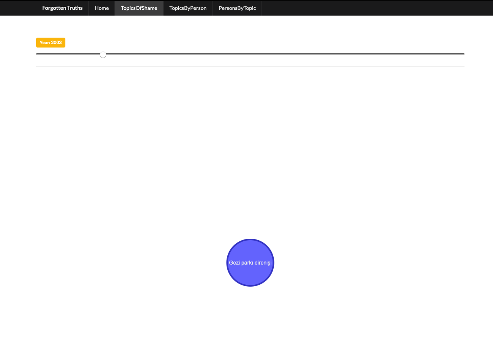
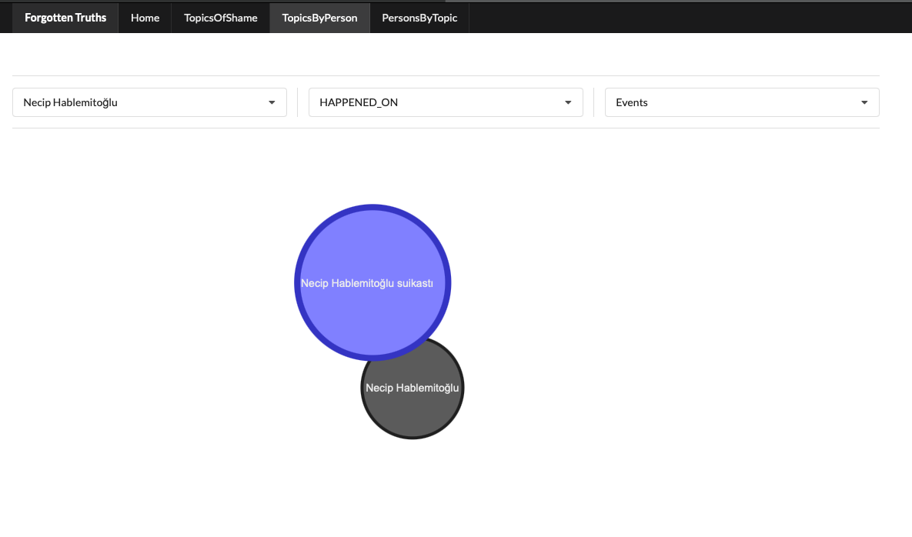
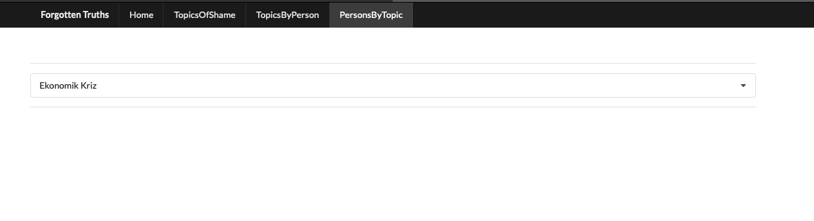

# README

Forgotten Truths was developed in order to not forget the truths.
In Turkey, our people is forgetful.  Now, people shall remember the truths.

### Home Page

This page have 4 components.

*  First component is statistic of death. 
*  Second component is "You must never forget!"
*  Third component is daily new
*  Fourd component is "Useful Contents"

> May be this component could be grow in the future

### Topics Of Shame

This page have a slider. We can remember to what happened the selected year.

### Topics By Person

This page shows topic according to selected person and relation.

### Persons By Topic

This page shows person according to selected topic.

